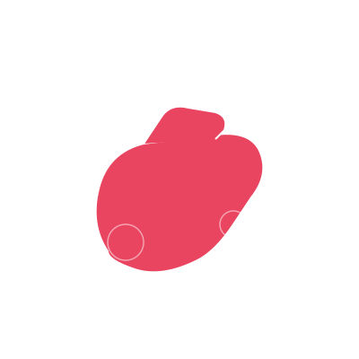

# SOLEMATE - Premium Shoes Store

## 🚀 Live Demo
[View Live Demo](https://xoralife.github.io/shoes-websites)

## 📸 Screenshots


## ✨ Features
- Modern glass-morphism UI design
- Fully responsive (Mobile, Tablet, Desktop)
- Product catalog with 8+ products
- Add to cart functionality with quantity controls
- Wishlist feature with heart toggle
- Countdown timer for promotions
- Category filtering with sort options
- Product quick view modal
- Size guide with US/UK/EU chart
- Customer testimonials section
- FAQ accordion section
- Newsletter subscription with success state
- Cookie consent banner
- Newsletter popup with discount offer
- Scroll progress indicator
- Back to top button
- Social share buttons
- Brand story section
- Instagram feed section
- Trust badges section
- Bundle offers section
- Reward points promotion
- Gift card section
- Referral program
- Order tracking form
- Shipping information
- Return policy section
- Live chat widget
- SEO optimized with sitemap
- PWA manifest support
- Accessibility (keyboard nav, screen reader)
- Smooth animations and micro-interactions

## 🛠️ Technologies Used
- Next.js 15 (App Router)
- TypeScript
- Tailwind CSS
- Lucide React Icons
- Google Fonts (Inter)

## 📁 Project Structure

```
shoes-ecommerce-website/
├── public/
│   └── images/
├── src/
│   ├── app/
│   │   ├── globals.css
│   │   ├── layout.tsx
│   │   └── page.tsx
│   ├── components/
│   │   ├── Header.tsx
│   │   ├── Hero.tsx
│   │   ├── FeatureStrip.tsx
│   │   ├── Categories.tsx
│   │   ├── FeaturedProducts.tsx
│   │   ├── ProductCard.tsx
│   │   ├── PromoBanner.tsx
│   │   ├── Testimonials.tsx
│   │   ├── Newsletter.tsx
│   │   ├── Footer.tsx
│   │   ├── CartSidebar.tsx
│   │   └── Toast.tsx
│   ├── context/
│   │   └── CartContext.tsx
│   └── hooks/
│       └── useCountdown.ts
├── package.json
└── README.md
```

## 🎨 Color Palette
- Primary: #1A1A2E
- Secondary: #E94560
- Accent: #0F3460
- Background: #F8F9FA

## 📱 Responsive Design
- Desktop: 1024px+
- Tablet: 768px - 1023px
- Mobile: < 768px

## 🔧 Installation

```bash
git clone https://github.com/xoralife/shoes-websites.git
cd shoes-ecommerce-website
npm install
npm run dev
```

## 🤝 Contributing
Pull requests are welcome!

## 📄 License
MIT

---

**Built with ❤️ by SOLEMATE Team | Version 1.0.0**
